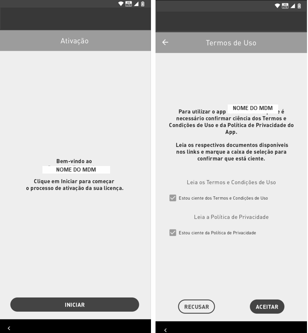
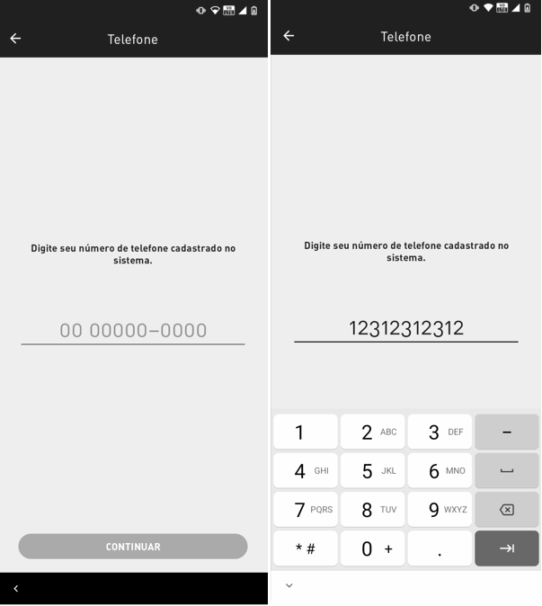
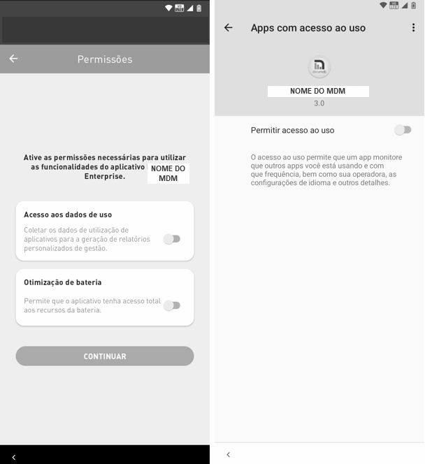
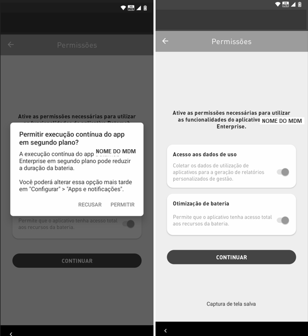

# Ativação

1. Para iniciar a ativação da licença, pressione o botão "Iniciar"
2. Leia e marque a caixa de seleção dos Termos e Condições de Uso do aplicativo e pressione "OK"

3. Após conceder as permissões, digite o número da licença;


**IMPORTANTE**

No caso de a empresa se registar na forma de licenças por quantidade, não será necessário comunicar um número de licença.


<figure><figcaption></figcaption></figure>

4. Ao ativar a permissão "Acesso aos dados de uso", será exibida a permissão solicitada

<figure><figcaption></figcaption></figure>

5. Na sequência será exibida uma notificação onde você deve clicar em "Permitir" para continuar com a ativação. Habilitar também a permissão Otimização da Bateria para habilitar o botão continuar

6. Pronto! A sua licença <mark style="background-color:orange;">Datamob Enterprise</mark> foi ativada. Clique em Terminar para iniciar o uso do dispositivo.

