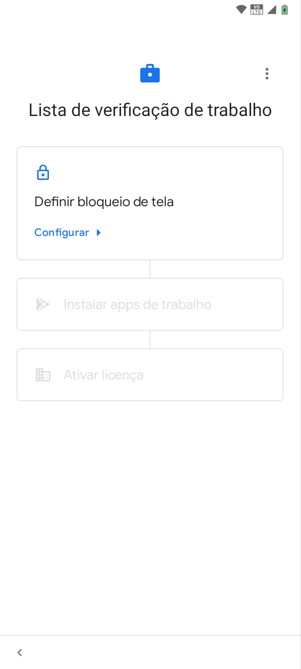
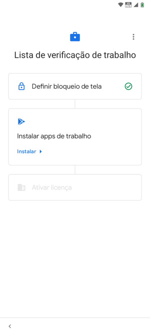
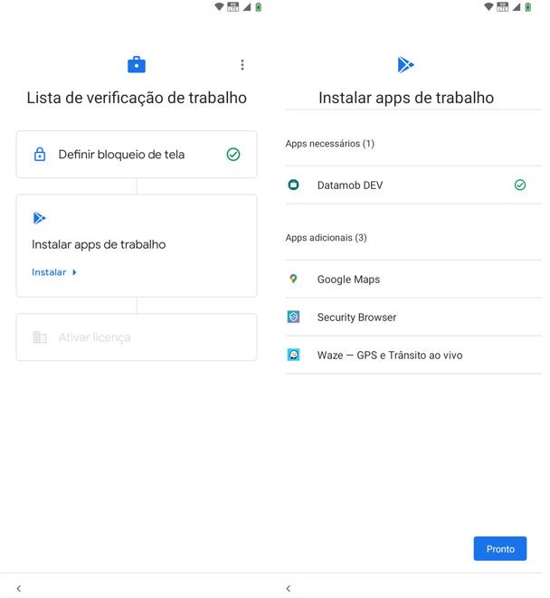
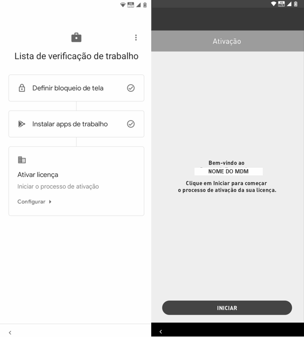

# Configurações

Depois de efetuar o registro através de uma das 3 opções citadas nas seções anteriores, será exibida a tela "Lista de Verificação de Trabalho", nesta tela realizaremos as configurações necessárias para avançar no processo de ativação da <mark style="background-color:orange;">Datamob Enterprise</mark>.

1. Aceitar e realizar todos os ajustes nas telas do dispositivo até chegar à seguinte tela

2. Defina um bloqueio de tela para o dispositivo:

3. Na lista de verificação de trabalho, o próximo passo é instalar aplicativos de trabalho. Pressione "Instalar". Na próxima tela serão exibidos os aplicativos de trabalho disponíveis para instalação. Isto depende das configurações de trabalho da empresa. Pressione o botão "Pronto" para continuar.

4. O próximo passo na tela "Lista de Verificação de Trabalho é "Ativar licença". Inicie o processo de ativação pressionando "Configurar". Após clicar em "Configurar", a tela aparecerá para iniciar a ativação do <mark style="background-color:orange;">Datamob Enterprise.</mark>

