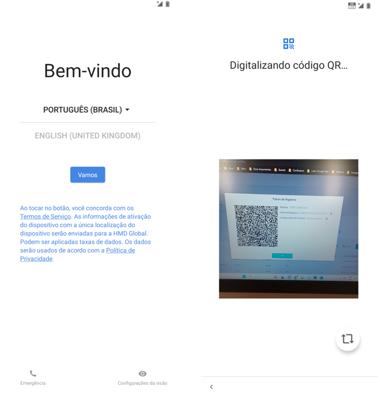
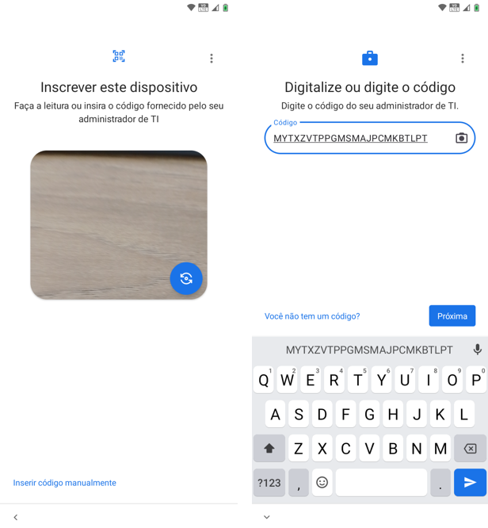

# Tipos de registro

Existem três formas possíveis de registo na **Datamob Enterprise**, são elas: leitura de QR Code, Token de registo e registo Zero Touch.

Explicaremos cada uma delas em detalhe nas seções seguintes deste manual.


**IMPORTANTE**

Antes de iniciar o registro através de qualquer uma das 3 opções, certifique-se de que o dispositivo está em modo de restauração de fábrica.


### Leitura de QR Code 

Para realizar o registro via QR Code, o usuário deve ter acesso ao código QR Code que deve ser gerado pelo administrador do sistema. Recebido o código , siga as instruções abaixo para realizar o registro:

1. Toque 6 vezes na tela do dispositivo com restauração de fábrica para iniciar o processo de registro com QR Code
2. Ler código QR

Depois de ler o QR Code, continue com as Configurações do Google ou do Sistema Operacional, até chegar à tela "Lista de Verificação de Trabalho".

### Token de Registro 

Para realizar o registro via Token, o usuário deve ter acesso ao código Token que deve gerar o administrador do sistema. O token pode ser usado se o usuário não conseguir ler o QR Code.

Neste caso o usuário deve clicar na opção destacada na primeira tela e realizar a digitação do código na segunda tela:

<figure><figcaption></figcaption></figure>

Depois de digitar o Código Token, você deve ativar as Configurações do Google ou o Sistema Operacional, até que ele chegue à tela "Lista de Verificação de Trabalho".

### Zero Touch 

No registo através do Zero Touch, o dispositivo é configurado automaticamente quando é ligado pela primeira vez. Você deve ativar as Configurações do Google ou do Sistema Operacional até que ele chegue à tela "Lista de Verificação de Trabalho"l. Você deve aceitar as permissões solicitadas e ativar a licença.
